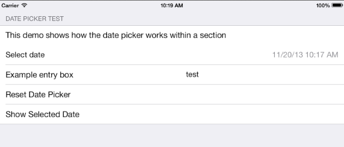

Xamarin iOS7 Date Picker
========================

Overview
--------

This is date picker control that conforms to the new iOS7 design guidelines.  "iOS 7 apps tend to embed date pickers within the content instead of displaying them in a different view. For example, Calendar dynamically expands a table row to let users specify a time without leaving the event-creation view." (https://developer.apple.com/library/ios/documentation/userexperience/conceptual/transitionguide/Controls.html)

NOTE: Ensure that you set "Root.UnevenRows = true;" in the constructor of your DialogViewController that uses this control (or any OwnerDrawnElement) in order for the CustomDateElement.Height() function to be called.

Screenshots of Sample Application
---------------------------------

DatePicker (Collapsed)

DatePicker (Exapanded in Edit Mode)

